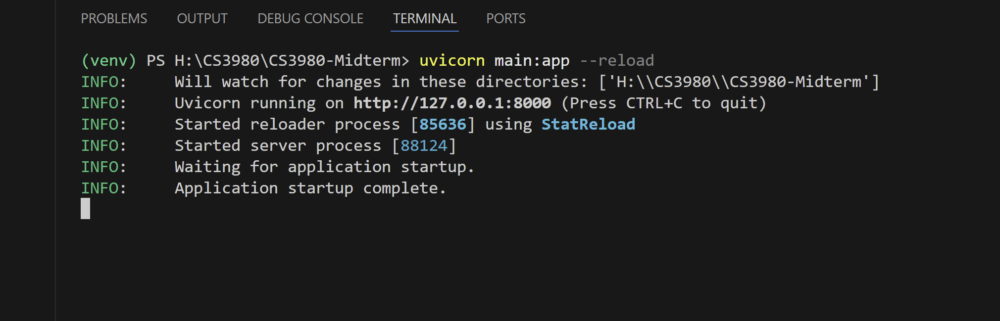
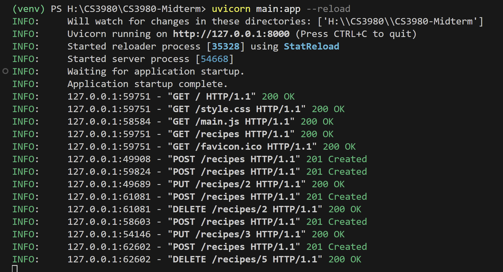
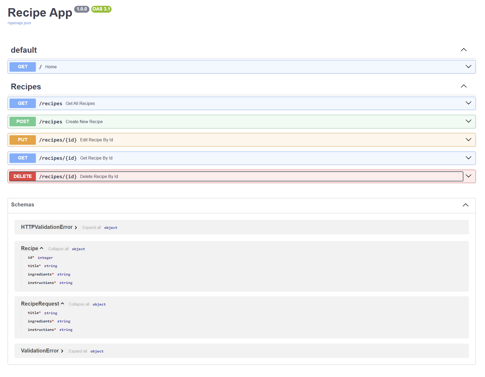
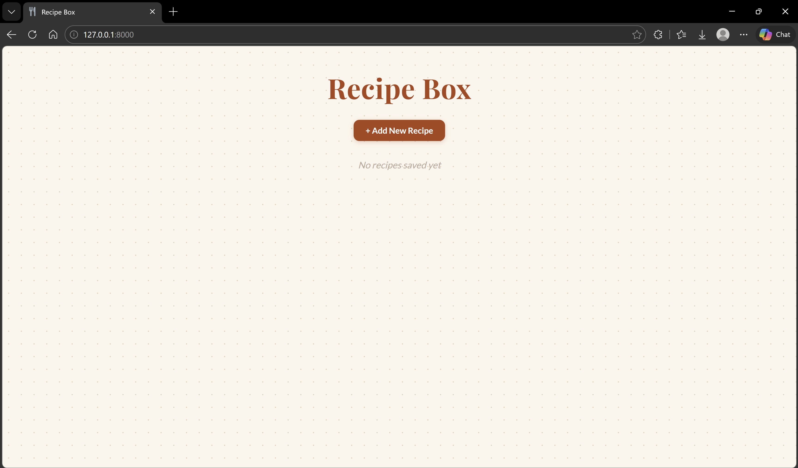
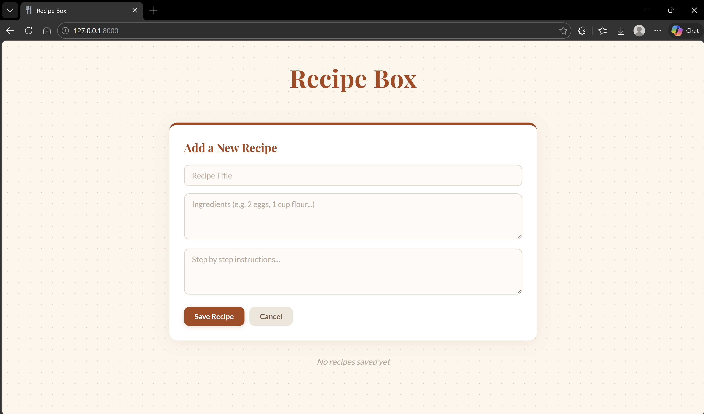
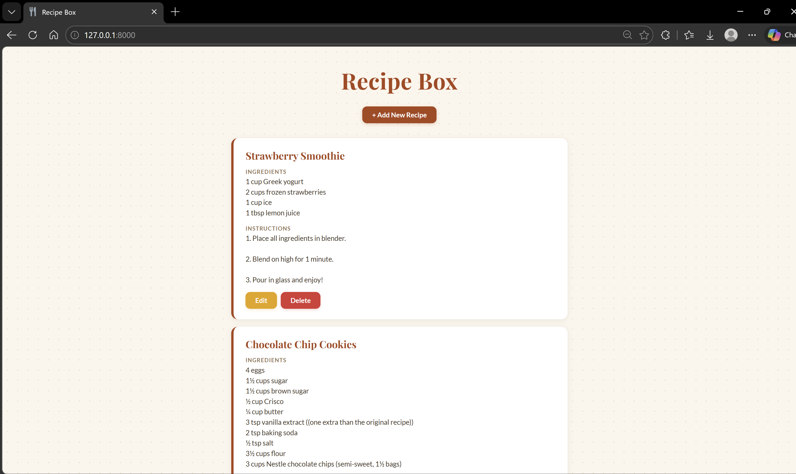
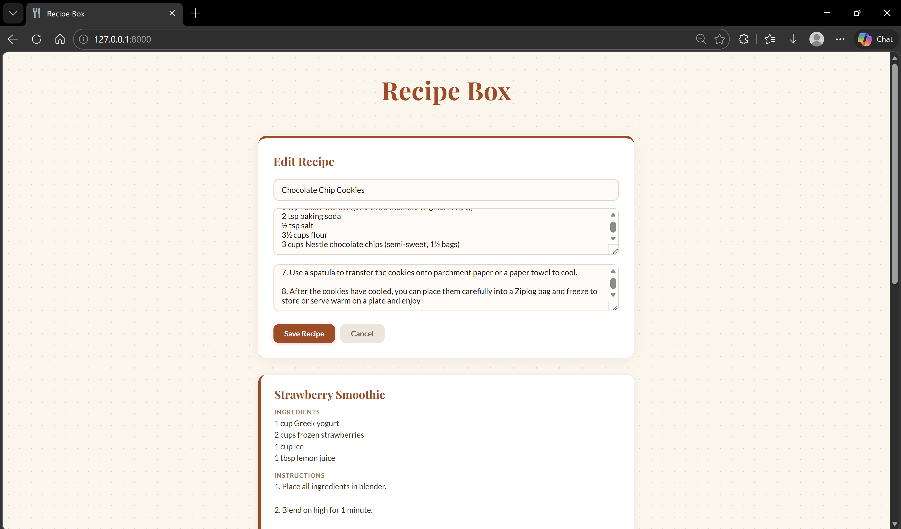
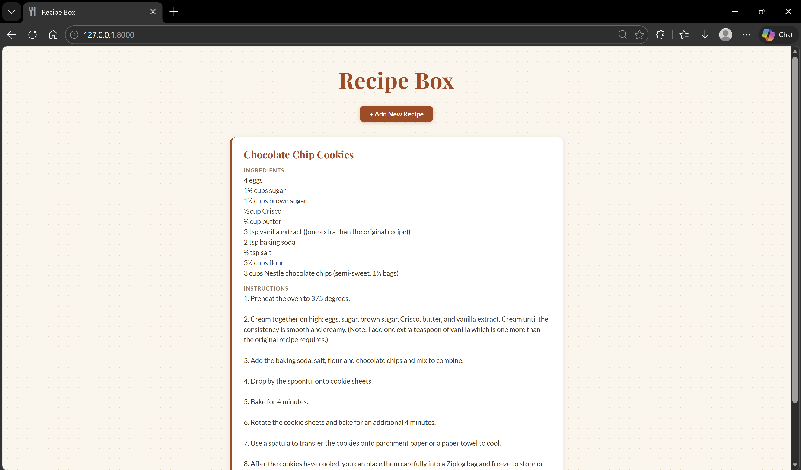

# CS3980-Midterm: Recipe Box 🍴

A simple full-stack web application built with **FastAPI** and **HTML/CSS/JavaScript** that allows users to create, view, edit, and delete recipes.


## About the App

**Recipe Box** is a CRUD web application where users can:
- Add new recipes with a title, ingredients, and instructions
- View all saved recipes on the main page
- Edit existing recipes
- Delete recipes they no longer need

All data is stored in an in-memory list on the backend (no database required).

---

## Setting Up the Virtual Environment

1. Make sure you have Python installed. Then, in the project root directory, run:
```bash
python -m venv venv
```

2. Activate the virtual environment:
```bash
venv\Scripts\activate
```

3. Install the required dependencies:
```bash
pip install fastapi uvicorn
```

---

## Running the Application

With the virtual environment activated, start the server from the project root:
```bash
uvicorn main:app --reload
```

Then open your browser and navigate to:
```
http://127.0.0.1:8000
```

#### Successful startup will show in the terminal as follows ...


#### Successful use of the app features will show in the terminal as follows ...


---

## API Endpoints

The backend is built with **FastAPI** and exposes the following REST endpoints under the `/recipes` prefix:

| Method | Endpoint | Description |
|--------|-----------------|--------------------------|
| GET | `/recipes` | Get all recipes |
| POST | `/recipes` | Create a new recipe |
| PUT | `/recipes/{id}` | Update a recipe by ID |
| DELETE | `/recipes/{id}` | Delete a recipe by ID |
| GET | `/recipes/{id}` | Get a single recipe by ID |

### Data Model

Each recipe contains the following fields:
```json
{
  "id": 1,
  "title": "Pancakes",
  "ingredients": "2 eggs, 1 cup flour, 1 cup milk",
  "instructions": "Mix and cook on medium heat."
}
```

FastAPI interactive docs can be found at `http://127.0.0.1:8000/docs`.


---

## Frontend Overview

The frontend is built with plain **HTML**, **CSS**, and **JavaScript** with no frameworks.

- **`index.html`** — Main page structure with the recipe form and recipe list container
- **`style.css`** — Styling using a warm color palette with Playfair Display and Lato fonts
- **`main.js`** — Handles all HTTP calls to the FastAPI backend using `XMLHttpRequest`, and manages rendering, form state, and CRUD interactions

The form to add a new recipe is hidden by default and opens when the user clicks **+ Add New Recipe**. After saving, the form closes automatically and the new recipe appears in the list.

---

## Application Screenshots

### Main Page


### Adding a Recipe


### Recipe List


### Editing a Recipe


### Deleting a Recipe
Recipe list after first "Strawberry Smoothie" recipe deleted ...
